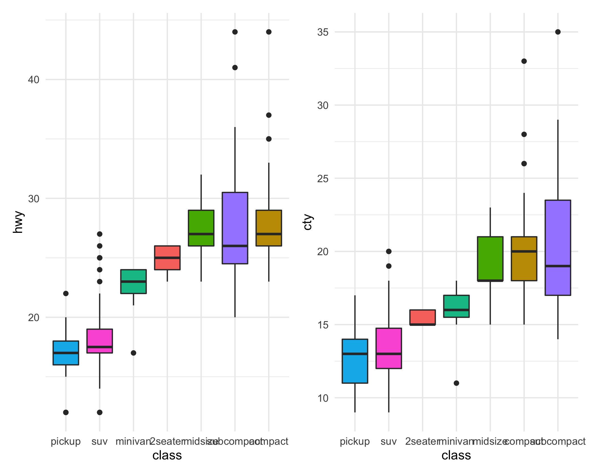

```{r include=FALSE}
library(tidyverse)
```


```{r echo=FALSE, fig.align="left", fig.width=8, fig.height=6, fig.cap="Figure: Here is a really important caption."}
mpg %>%
  ggplot( aes(x=reorder(class, hwy), y=hwy, fill=class)) + 
    geom_boxplot() +
    xlab("class") +
  theme_minimal() +
  guides(fill=F)
```

<style>
div.blue { background-color:#e6f0ff; border-radius: 5px; padding: 20px;}
</style>
<div class = "blue">

- This is my first conclusion
- This is my second conclusion

</div>

***
# Test tab use {.tabset .tabset-fade .tabset-pills}

## First
A first section

## Second
content of sub-chapter #2

## Third
content of sub-chapter #3
***

# new section

{ width=100% }


